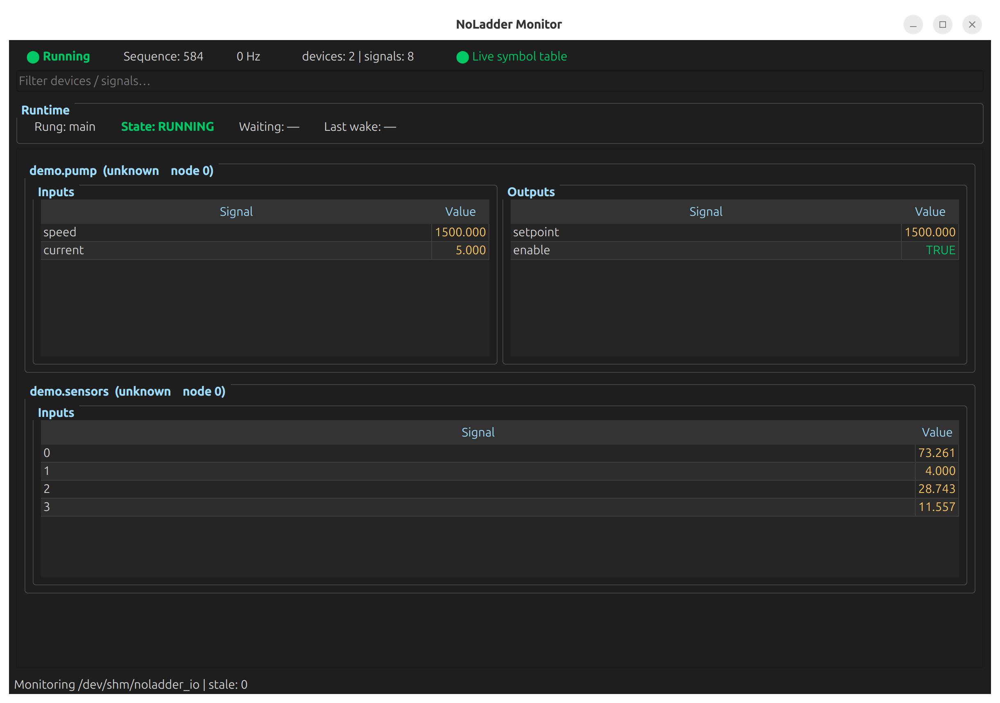

**If Linux has a driver for it — NoLadder can use it as a bus device.**

Industrial control runtime for Linux IPCs, written in Rust.
For people who can program.

**Status:** early development — suitable for experimentation and testing.

---

You looked at Structured Text.
You wondered why control software still looks like 1993.

There is a better way.
This is it.

---

## What It Is

NoLadder is an open source industrial control runtime written in Rust.
It runs on any Linux IPC with a standard Ethernet port.

It replaces proprietary PLC runtimes with a clean, modern architecture
that software engineers can actually work with.

Your control logic is Rust.
Your IO is numbers.
Your hardware is described in a TOML file.
The runtime handles the rest.

---

## How It Works

Three processes. One shared memory region. No proprietary runtime.
```
noladder-bus        owns hardware, speaks protocols
        ↕ /dev/shm/noladder_io
noladder            RT control loop, runs your logic
        ↕ /dev/shm/noladder_io
noladder-monitor    live IO inspector, any tool can read it
```

The bus server handles the wire — Modbus, EtherCAT, CAN,
SDL2 joystick, GPS, camera, anything Linux can read.
Your control logic never knows what protocol a device uses.
Swap hardware without changing a line of control code.

---

## Get Started in 3 Commands

No hardware required. Fresh Linux? No problem.

```bash
git clone https://github.com/sihvoar/noladder
cd noladder
./tools/setup.sh
```

That's it. The setup script handles:
- System dependencies (build tools, graphics libs)
- Rust toolchain (if needed)
- Building the project
- Python packages (PySide6, pymodbus)

Then run the demo (opens 5 windows):
```bash
./tools/launch_hello_world.sh
```

Watch the monitor display pump speed ramping up and down as the control loop reacts to tank levels.
"Hello World!" prints every 2 seconds.
That is the entire stack working end to end.

**New to NoLadder?** → Read [GETTING_STARTED.md](GETTING_STARTED.md)

---

## What You Write
```rust
fn register_rungs(
    arena: &mut Arena,
    map:   &DeviceMap,
) -> Result<()> {

    let coil = map.input("hello.coil");

    arena.add(rung!(hello_world, {
        ctx.yield_until(coil, true).await;

        ctx.os_request(
            "log.message",
            b"Hello World",
        ).await;
    }));

    Ok(())
}
```

A rung wakes when a condition is met.
It can suspend across cycles without blocking the loop.
No state machines. No nested ifs. No flags.

---

## Screenshot

The monitor reads the shared IO image directly.
Inspect every device and signal live, no configuration needed.



---

## Documentation

- User guide → [docs/UserGuide.md](docs/UserGuide.md)
- Architecture → [docs/ARCHITECTURE.md](docs/ARCHITECTURE.md)
- Design notes → [docs/DESIGN.md](docs/DESIGN.md)
- Adding a bus device → [docs/BusDrivers.md](docs/BusDrivers.md)

---

## License

MIT — [Copyright 2025 AP Sihvonen](LICENSE)
